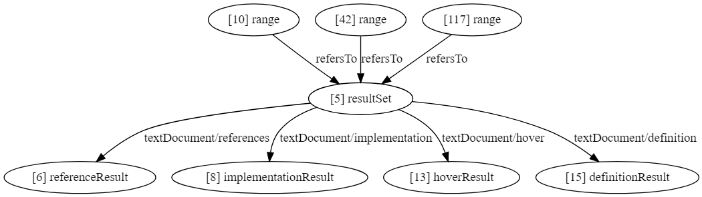

# About
Scripts to help [LSIF](https://github.com/Microsoft/language-server-protocol/blob/master/indexFormat/specification.md) developers. Featuring:

* Graph visualization
* Quick search
* [WIP] Validation

# Getting Started

- `> git clone this repository`
- `> cd lsif-util`
- `> npm install`
- `> tsc -p .\tsconfig.json`

# Search

`> node .\lib\search.js [options]`

The search has a lot of options, but don't let yourself be intimidated! Most translate to the same idea of listing what you are interested in.

| Option            | Description                                                                             |
|-------------------|-----------------------------------------------------------------------------------------|
| --inputPath or -p | Path to input file (JSON)                                                               |
| -id               | Look for specific ids                                                                   |
| -inV              | Look for edges entering any of these ids                                                |
| -outV             | Look for edges leaving any of these ids                                                 |
| -type             | Look for nodes of any of these types (e.g. vertex, edge)                                |
| -label            | Look for nodes with any of these labels (e.g. textDocument/definition, referenceResult) |
| -property         | Look for nodes with any of these properties (e.g. item, contains)                       |
| -regex            | Look for nodes that fit this regular expression                                         |
| --idOnly or -i    | Only output ids (without more information)                                              |

You can combine the above options to narrow down what you are looking for. For example, say you have the following code snippet:

```
class foo {
    bar(): void {
        // ...
    }
}
```

If you want to find the declaration of `bar`, you can do:

`> node .\lib\search.js -type vertex -label range -regex bar`

# Graph

`> node .\lib\graph.js [options] targetVertices`

After the options, you should specify one or more `targetVertices`. These are the vertices in your JSON file that you are interested in.

| Option            | Default     | Description                                             |
|-------------------|-------------|---------------------------------------------------------|
| --inputPath or -p | ./lsif.json | Path to input file (JSON)                               |
| --distance or -d  | 1           | Max distance between any vertex and the target vertices |
| --verbose or -v   | false       | Display more information about the vertices             |

Example:
`> node .\lib\graph.js -d 2 15`

The output will be a [DOT](https://graphviz.gitlab.io/_pages/doc/info/lang.html) graph.

The following image was created using [Viz.js](http://viz-js.com/)



# Combining the tools for best results

Let's say we have this typescript code snippet:

```
class foo {
    bar(): void {
        // ...
    }
}

let a: foo = new foo();
a.bar();
```

We want to check if `a.bar` is pointing to the correct `resultSet`.

It would be nice to see the LSIF graph for `a.bar`, but we don't know its vertex id. We can search for it:

`> node .\lib\search.js -type vertex -label range -regex bar`

This will return two objects: one for the declaration at line 2 and one for the invocation at line 8. Now we have the ids we need to draw the graph!

An option is to use the `--idOnly` flag. We can save the output to a variable:

`> $myIds = node .\lib\search.js -type vertex -label range -regex bar --idOnly`

Now we can run the graph tool passing the ids we found:

`> node .\lib\graph.js $(echo $myIds)`

This is the result:


The two ranges for bar (22 and 53) point to the same `resultSet`, which is good news!